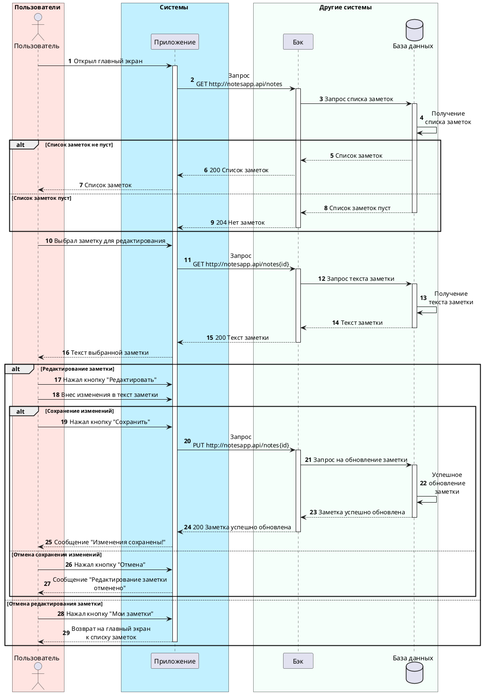

---
hide:
  - toc
---
# Пользовательский сценарий «Редактирование заметки»

## Действующие лица:
1. Пользователь
2. Приложение
3. Бэк
4. База данных

## Предварительные условия
1. Пользователь должен находиться на главном экране.
2. На главном экране должен быть отображен непустой список заметок.

## Выходные условия
В случае выполнения основного сценария, в системе сохранились изменения, внесенные пользователем в заметку.

## Основной сценарий
1. Пользователь нажимает на заметку, в которую хочет внести изменения.
2. Приложение открывает окно с формой редактирования заметки.
3. Пользователь нажимает кнопку **Редактировать**.
4. Пользователь вносит изменения в заметку.
5. Пользователь нажимает кнопку **Сохранить**.
6. Приложение отправляет запрос Бэку на сохранение изменений в заметке.
7. Бэк сохраняет изменения в Базе данных.
8. Бэк возвращает Приложению ответ об успешном сохранении изменений.
9. Приложение открывает пользователю уведомление «Изменения сохранены!».

## Альтернативный сценарий №1
1. Пользователь нажимает на заметку, в которую необходимо внести изменения.
2. Приложение открывает окно с формой редактирования заметки.
3. Пользователь нажимает кнопку **Мои заметки**.
4. Приложение открывает пользователю главный экран.

## Альтернативный сценарий №2
1. Пользователь нажимает на заметку, в которую необходимо внести изменения.
2. Приложение открывает окно с формой редактирования заметки.
3. Пользователь нажимает кнопку **Редактировать**.
4. Пользователь вносит изменения в заметку.
5. Пользователь нажимает кнопку **Отменить**.
6. Приложение открывает пользователю уведомление «Редактирование заметки отменено».

# Диаграмма последовательности


??? "Код диаграммы"

    ```
    @startuml
    skinparam {
     minClassWidth 50
     boxPadding 25
     maxMessageSize 260
     participantPadding 60
     sequenceMessageAlignment center
     responseMessageBelowArrow true
    }
    box Пользователи #mistyRose
    actor "Пользователь" as front
    end box
    autonumber
    box Системы #application
    participant "Приложение" as app
    end box
    box "Другие системы" #mintCream
    participant "Бэк" as b
    database "База данных" as db
    end box
    
    front -> app++: Открыл главный экран
    app -> b++: Запрос\nGET http://notesapp.api/notes
    b -> db++: Запрос списка заметок
    db -> db:  Получение\nсписка заметок
    alt Список заметок не пуст
    db --> b: Список заметок
    b --> app: 200 Список заметок
    app --> front: Список заметок
    else Список заметок пуст
    db --> b--: Список заметок пуст
    b --> app--: 204 Нет заметок
    end
    
    front -> app: Выбрал заметку для редактирования
    app -> b++: Запрос\nGET http://notesapp.api/notes{id}
    b -> db++: Запрос текста заметки
    db -> db:  Получение\nтекста заметки
    db --> b--: Текст заметки
    b --> app--: 200 Текст заметки
    app --> front: Текст выбранной заметки
    
    alt Редактирование заметки
    front -> app: Нажал кнопку "Редактировать"
    front -> app: Внес изменения в текст заметки
     alt Сохранение изменений
     front -> app: Нажал кнопку "Сохранить"
     app -> b++: Запрос\nPUT http://notesapp.api/notes{id}
     b -> db++: Запрос на обновление заметки
     db -> db: Успешное\nобновление\nзаметки
     db --> b--: Заметка успешно обновлена
     b --> app--: 200 Заметка успешно обновлена
     app --> front: Сообщение "Изменения сохранены!"
     else Отмена сохранения изменений
     front -> app: Нажал кнопку "Отмена"
     app --> front: Сообщение "Редактирование заметки отменено"
     end
    else Отмена редактирования заметки
    front -> app: Нажал кнопку "Мои заметки"
    app --> front--: Возврат на главный экран\nк списку заметок
    end
    ```