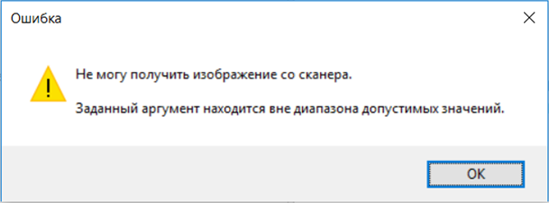

# Порядок использования утилиты для распознавания документов

Запуск утилиты распознавания удостоверений личности может осуществляться как обычным для приложений способом (запуском исполняемого файла *PassportReader.exe*), так и из МИС через кнопку, размещенную на какой-либо экранной форме. Для удобства работы пользователей и корректного взаимодействия утилиты с МИС рекомендуется использовать второй вариант.

После запуска утилиты открывается её основное окно, <a href="#рис_1">рис.1</a>.

 В зависимости от способа и параметров запуска утилиты процессы сканирования и распознавания могут быть выполнены как в ручном режиме (частично или полностью), так и автоматически (частично или полностью).

Если после запуска утилиты процесс сканирования не был запущен автоматически, необходимо нажать кнопку **Сканировать**. При необходимости в меню кнопки **Сканировать** может быть предварительно выбран сканер. После успешного выполнения сканирования в окне утилиты отобразится изображение отснятой страницы документа, <a href="#рис_1">рис.1</a>.
 

|  |
|:--:| 
| *Рисунок 1. Окно утилиты Passport Reader* |

Если в ходе сканирования возникнут технические проблемы, будет выдано соответствующее сообщение об ошибке <a href="#рис_2">рис.2</a>.

|  |
|:--:| 
| *Рисунок 2. Сообщение о технических неполадках* |

 
После завершения сканирования документа он может быть распознан. Если процесс распознавания не был запущен автоматически, необходимо нажать кнопку **Распознать**. Предварительно могут быть изменены страна и тип документа (пункты меню слева от кнопки Распознать). После выполнения распознавания в окне утилиты справа отобразятся распознанные данные, <a href="#рис_3">рис.3</a>.

|  |
|:--:| 
| *Рисунок 3. Окно утилиты с распознанными данными* |
 
При нажатии на строку **Показать вспомогательные поля** отобразятся значения полей с машиночитаемой зоны документа (при отсутствии таковой – значения аналогичных обычных полей), а также миниатюра изображения, которое может быть сохранено на диск (при использовании соответствующих настроек при запуске утилиты), <a href="#рис_4">рис.4</a>.

|  |
|:--:| 
| *Рисунок 4. Вспомогательные поля* |
 
Если при распознавании текста возникнут ошибки, будет выдано соответствующее сообщение, <a href="#рис_5">рис.5</a>.

|  |
|:--:| 
| *Рисунок 5. Сообщение об ошибке распознавания* |
 
В этом случае (а также при использовании соответствующей настройки при запуске) раздел с распознанными данными будет открыт в режиме редактирования, <a href="#рис_6">рис.6</a>, при котором все поля в разделе с распознанными данными могут быть отредактированы пользователем (при вводе букв они автоматически преобразуются в прописные).

| {#ris6}|
|:--:| 
| *Рисунок 6. Окно утилиты в режиме редактирования распознанных данных* |

Чтобы сохранить внесенные изменения нужно нажать кнопку    **Продолжить**.

Чтобы выйти из режима редактирования без сохранения изменений необходимо нажать кнопку    **Отменить**.

После окончания всех действий необходимо нажать кнопку Выход. Утилита закроется или, при наличии соответствующих настроек, свернется в трей.
В зависимости от настроек, с которыми была запущена утилита, по результатам распознавания может быть создан файл XML с полученными данными и файл JPG с изображением результата сканирования. Также, если утилита запускалась с экранной формы МИС МЕДИАЛОГ, на  которой настроены поля для внесения распознанных данных, они также могут быть заполнены, <a href="#рис_7">рис.7</a>.

|  |
|:--:| 
| *Рисунок 7. Поля с распознанными данными* |